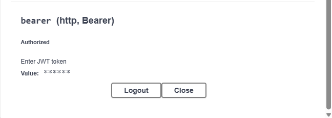

# Authentication System Guide

## 🚀 How to run project

### Prerequisites

- Node.js (v18+)
- Neon database (already setup)
- Git

### Setup & Run

```bash
# 1. Clone and install dependencies
git clone <repo-url>
cd authen
npm install

# 2. Database is already available in .env
# DATABASE_URL has been configured for Neon

# 3. Generate Prisma client and sync schema
npx prisma generate

# 4. Start app
npm run start
# App runs at: http://localhost:3000
# Swagger UI: http://localhost:3000/api
```

---

## 🔐 3 Types of Authentication

### 1. **Internal Key Guard** - Internal client

**Use case**: Only a few internal clients (under 10), need to identify these clients

**Implementation**: `ApiKeyGuard`

- Key is stored in `.env` file: `INTERNAL_API_KEY=my-super-secret-key-123`
- Direct comparison with config
- No database lookup needed

### 2. **Client API Key Guard** - Registered client

**Use case**: Many clients, can register to use service at any time

**Implementation**: `ClientApiKeyGuard`

- Key is stored in database (`Client` table)
- Can enable/disable client (`isActive` field)
- Scalable for many clients

### 3. **JWT Guard** - User authentication

**Use case**: Authentication for end users, session management

**Implementation**: `JwtGuard` + `JwtRefreshGuard`

- Access token (15 minutes) + Refresh token (7 days)
- User data in database
- Secure session management

### 4. **Either Auth Guard** - Flexible (Combo)

**Use case**: Endpoint accepts any type of auth above

**Implementation**: `EitherAuthGuard`

- Try internal key → client key → JWT
- If 1 of 3 is valid then allow
- Attach `req.authType` and `req.user/req.client`

---

## 🧪 Test on Swagger UI

### Setup

1. Open http://localhost:3000/api
2. Click **Authorize** (top right)
3. Enter auth for scheme you want to test:

### Test Cases

- **Internal API Key**: Enter `my-super-secret-key-123` in "API Key" field
  

- **Client API Key**: Enter `service-a-key-123` (or `service-a-key-456`, `service-a-key-789`) in "API Key" field
  
- **JWT Bearer**:
  1. Call POST `/auth/signup` first
  2. Copy `access_token` from response
  3. Enter in "Bearer Token" field
     

### Test Film Endpoints

After authorize, try:

- `GET /film` - Get list of films
- `POST /film` - Create new film
- `GET /film/{id}` - Get film by ID
